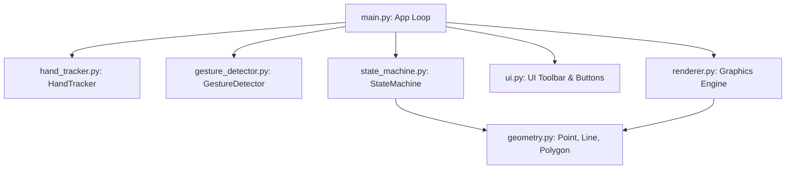

# GestureCAD 🖐️📐

**GestureCAD** is a high-performance, real-time 2D CAD and vector graphics editor controlled entirely by hand gestures captured via a webcam. By utilizing MediaPipe Hands for skeleton landmarks tracking, NumPy for fast math calculations, and OpenCV for responsive UI overlay rendering, users can draw, close, hover select, and translate polygons in air.

---

## 🚀 Key Features

* **Real-time Hand Tracking**: Identifies 21 key joint landmarks at 30+ FPS.
* **Dynamic Visual Feedback**: Hand skeleton colors change dynamically based on the recognized gesture (e.g., green for Open Palm, red for Pinch, orange for Fist).
* **Robust Gesture Engine**:
  * **Pinch (Thumb + Index)**: Places vertices dynamically. Edge-triggered to register exactly one vertex per pinch click.
  * **Open Palm**: Auto-closes the polygon (connects last vertex to the first) and saves it with a randomized vivid fill color.
  * **Closed Fist**: Grabs and translates/slides polygons smoothly across the screen.
  * **Index Finger Hover**: Highlights polygons using ray-casting collision and vertex proximity hit-testing.
* **Semi-Transparent HUD Overlay**: Custom glassmorphism-inspired OpenCV UI displaying modes, live FPS counter, instruction prompts, and responsive button menus.
* **Hybrid Control System**: Full physical mouse-control fallback (move cursor, click buttons/draw) alongside camera tracking for easy debugging and testing.
* **Saving & Exporting**: Instant serialization of polygon vector coordinate coordinates to structured JSON files, accompanied by timestamped PNG screenshots.

---

## 🛠️ Installation & Setup

### Prerequisites
* Python 3.12+ (Compatible with Python 3.9+)
* Webcam connected to your PC

### Setup Steps
1. Clone the repository or navigate to the directory:
   ```bash
   cd GestureCAD
   ```

2. Install dependencies:
   ```bash
   pip install -r requirements.txt
   ```

3. Launch the application:
   ```bash
   python src/main.py
   ```

---

## 🎮 Interface Controls

### 1. Hand Gestures

| Gesture | Hand Pose | Actions / Transitions |
|:---|:---|:---|
| **Pinch** | Thumb and Index fingers touching | • Starts a new shape drawing<br>• Adds a point to the active shape (once per pinch) |
| **Open Palm** | All 5 fingers extended | • Closes active polygon shape (min. 3 points)<br>• Automatically transitions back to IDLE state |
| **Index Hover** | Index extended; other fingers curled | • Moves cursor<br>• Highlights polygon when hovering over edges or boundaries |
| **Closed Fist** | All 5 fingers curled in | • Grabs a highlighted polygon and translates it relative to hand movements |

### 2. Keyboard Shortcuts

* **`C`** or **`c`** : Clear the active polygon currently being drawn.
* **`R`** or **`r`** : Reset canvas (deletes all completed shapes).
* **`S`** or **`s`** : Save screenshot and export coordinates as JSON.
* **`ESC`** : Exit GestureCAD.

### 3. Virtual UI Buttons
Located in the upper right corner of the HUD toolbar:
* **CLEAR (C)**: Clears active sketch points.
* **RESET (R)**: Resets session and clears all polygons.
* **SAVE (S)**: Saves screenshot and exports data.
* *How to click:* Hover the hand pointer cursor over the button box and make a **Pinch** gesture, or click using your physical mouse.

---

## 📐 Software Architecture

The codebase adheres strictly to object-oriented programming (OOP) principles and separation of concerns:



* **`geometry.py`**: Defines geometric mathematical concepts:
  * `Point`: Distance formulas and translations.
  * `Line`: Distance from point to line segment formula.
  * `Polygon`: Bounding box min/max, centroid, translation, and hit-detection using Ray-Casting algorithm.
* **`hand_tracker.py`**: MediaPipe wrapper extracting 21 points and calculating hand-to-camera scale for threshold normalization.
* **`gesture_detector.py`**: State classifier mapping joint distances and knuckle angles to discrete gestures. Handles pinch click edge-triggers.
* **`state_machine.py`**: Controls flow of application states (`IDLE`, `DRAWING`, `POLYGON_COMPLETE`, `MOVING`).
* **`ui.py`**: Renders HUD toolbar, handles mouse click bindings, and monitors cursor intersections with buttons.
* **`renderer.py`**: Responsible for BGR visual overlays, alpha blended translucency fills, skeleton links, bounding boxes, and crosshair centroids.

---

## 📁 Saved Data Format

When pressing **`S`** (or using the **SAVE** button), files are stored inside the `assets/` folder:
* **Screenshots**: saved as `assets/screenshot_YYYYMMDD_HHMMSS.png`
* **Polygon Data**: saved as `assets/polygons_YYYYMMDD_HHMMSS.json` in this vector format:
```json
[
    {
        "vertices": [
            [250.0, 180.0],
            [320.0, 140.0],
            [390.0, 220.0]
        ],
        "color": [150, 220, 120],
        "is_closed": true
    }
]
```

---

## 🔮 Future Roadmap

* **Rotate Gesture**: Detect coordinate rotations relative to hand roll angle.
* **Scale Gesture**: Pinch with both hands to scale shapes proportionally.
* **Undo / Redo Buffer**: Command design pattern implementing histories.
* **SVG / DXF Export**: Support industry-standard CAD/Vector formats.
* **3D Manipulator**: Use MediaPipe Depth to push, pull, or extrude shapes into 3D objects.
